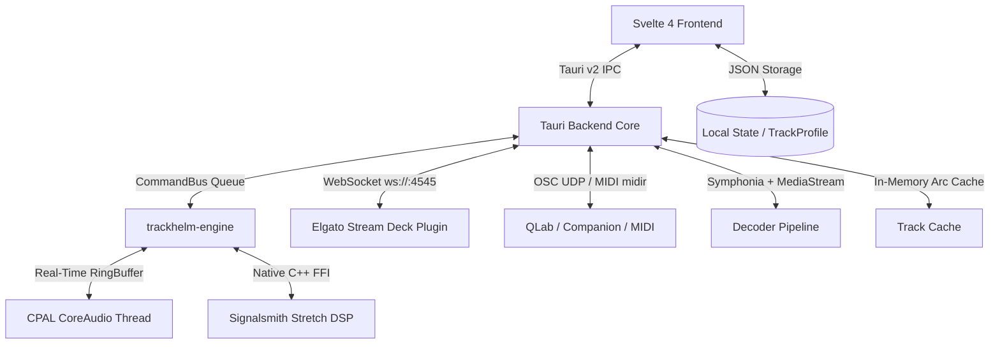

# TrackHelm 🎵

**TrackHelm** is a high-performance music rehearsal, transcription, and playback workstation built for musicians, musical directors, sound designers, and audio engineers. 

It combines real-time DSP pitch/time manipulation, instant deep-zoom waveform visualization, persistent per-song rehearsal profiles, dynamic multi-PDF sheet music & take tracking, interactive parametric EQ & dual-stage compression consoles, offline audio export, and low-latency native CoreAudio playback with comprehensive Stream Deck / MIDI / OSC show control integration.

---

## Key Features

### 🎧 Real-Time Rehearsal DSP Engine
* **Signalsmith Stretch Real-Time Integration**: Pristine, glitch-free tempo stretching ($0.25\times$ to $4.00\times$) and musical pitch transposition ($-24$ to $+24$ semitones) without cross-talk artifacts or audible buffer glitches. Permanently engaged by default at unity for seamless live modulation.
* **Sonitus-Inspired Dual-Stage Compressor Console**:
  * Dual independent compressor stages (`Stage 1` & `Stage 2`) switchable between **Series** and **Parallel** routing with wet/dry blend.
  * 4 analog & digital character models: **Vintage** (Tube), **Modern** (Clean VCA), **FET** (Ultra-Fast), and **Opto** (Smooth Optical).
  * Exact analytical soft-knee transfer function curve with **animated live signal tracing dot**, dual stereo input/output peak meters, vertical threshold/makeup sliders, and fast-decay gain reduction (GR) meter.
* **Kirchhoff & AnyTune-Inspired Parametric Equalizer Console**:
  * Multi-filter cascaded biquad engine: **Parametric Bell (Peaking)**, **Low Shelf**, **High Shelf**, **Low Pass (High Cut)**, **High Pass (Low Cut)**, and **Notch (Band Stop)**.
  * Continuous logarithmic frequency spectrum graph ($20\text{ Hz} - 20\text{ kHz}$) with real-time 64-band animated Real-Time Analyzer (RTA) frequency spectrum and dynamic cumulative analytical EQ response curve.
  * **Interactive Node Dragging**: Click and drag filter nodes directly on the graph (horizontal for logarithmic frequency, vertical for gain $\pm 24\text{ dB}$).
  * **Mouse Wheel / Trackpad Q Control**: Scroll over nodes to expand or narrow filter bandwidth ($Q: 0.10 - 10.00$).
  * **Quick Add Bands**: Double-click anywhere on empty graph space or click `+ Add Filter Band` to drop a new filter node.
  * **Logarithmically Mapped Frequency Sliders**: Natural, uniform spacing across all octaves from $20\text{ Hz}$ to $20\text{ kHz}$.
* **Dedicated Module Bypass Toggles (`BYP`)**: Instant A/B bypass switches directly on the effects rack rows and inspector dialogs.
* **Low-Latency CPAL CoreAudio Engine**: Lock-free native audio thread with zero heap allocations on the audio loop.
* **Hardware-Style Analog Dials**: Vertical drag controls with top 12 o'clock zero reference ticks (`.knob-zero-tick`) and double-click instant reset to defaults.

---

### 🕹️ Stream Deck, MIDI & OSC Show Control (Milestone 8)
* **Elgato Stream Deck Plugin (`com.trackhelm.controller.sdPlugin`)**:
  * Pre-built 15-key and 32-key show control profiles with custom high-contrast retina LCD icons.
  * **Real-Time Dynamic LCD Readouts**:
    * **Song Info Display**: Active track name and live elapsed time (`MySong.wav\n01:24.50`).
    * **Current Landmark Display**: Active marker name and cue timestamp (`⚐ Verse 1\n00:34.20`).
    * **Pitch Up / Down**: Action and active semitones (`+1 Semi\n+2.0 st`).
    * **Volume Up / Down**: Action and calibrated dB gain (`+1 dB\n-3.0 dB`).
    * **Speed Up / Down**: Action and active tempo multiplier (`+5% Spd\n1.15x`).
    * **Play / Pause**: Real-time state indicator and time (`▶ Play\n01:24.50`).
    * **Rewind & Playlist Nav**: Current position and track counts (`Next ⏭\nTrk 2/8`).
  * **Direct One-Click Installer**: Dedicated `Build Stream Deck Plugin.app` packages and installs the plugin directly into Stream Deck's application directory.
* **WebSocket Control Server (`ws://0.0.0.0:4545`)**: Fast, non-terminating lag-tolerant two-way WebSocket broadcast server for custom remote apps and hardware controllers.
* **OSC Integration (`/trackhelm/*`)**: UDP-based Open Sound Control endpoints for QLab, Bitfocus Companion, and digital mixing consoles.
* **Hardware MIDI Integration (`midir`)**: Real-time MIDI hardware support with CC 7 Volume, CC 1 Speed modulation, and Note-on transport triggers.

---

### 💾 High-Fidelity Audio Export Engine (Milestone 9)
* **Non-Destructive Offline DSP Render (`Cmd+Shift+E`)**:
  * Offline multi-threaded audio renderer baking all active DSP parameters into pristine audio files.
  * **Configurable Export Options**:
    * Range Selection: Full Song, Active Time Selection, or Selected Region.
    * Bit Depth Formats: 16-bit WAV (CD Standard), 24-bit WAV (Studio Master), or 32-bit Float WAV.
    * Optional DSP Bakes: Speed / Tempo multiplier, Pitch transposition semitones, EQ cascade, and Dual-Stage Compressor.
    * Region Cut Bakes: Automatically removes cut spans with smooth equal-power crossfading.
    * Metadata Tag Copying: Preserves ID3v2 / Vorbis tags and cover art in rendered output.

---

### 📝 Rehearsal Deck: Dynamic Multi-PDFs & Markdown Notes/Lyrics
* **Rehearsal Files Hub (`FILES` Tab)**: Central manager for all associated sheet music, chord charts, alternate takes, guide tracks, and stems with one-click opening and loading.
* **Dynamic Multi-PDF Tabs**: Opening associated PDFs automatically spawns dedicated dynamic tabs (e.g. `📄 Chart.pdf ×`) with independent page scroll tracking, close buttons, and **Negative Invert** dark mode for stage readability.
* **Obsidian-Style Markdown Notes & Lyrics**: Rich formatting for song notes, arrangement guides, and lyrics with Edit, Preview, and Side-by-Side Split view modes.
* **Automatic Rehearsal Chord Badge Parsing**: Parses chords (e.g. `[Am7]`, `[G/B]`, `[Cadd9]`) into glowing high-contrast badges optimized for live performance reading.

---

### ⚡ Instant Loading & Deep Waveform Visualization
* **Zero-Delay Playback Readiness ($< 1\text{ms}$)**: Single-click background pre-decoding (`preload_track`) and SIMD/NEON compiler optimizations (`opt-level = 3`) ensure songs start playing instantaneously.
* **Continuous Unbroken Oscillating Waveform**: Single-sample continuous line rendering at all zoom levels, eliminating sawtooth min/max ramp gaps.
* **Progressive Sample Node Squares (RX Style)**: Visualizes individual audio sample points with adaptive bordered node boxes when zoomed in ($\le 400$ samples down to 9 samples).
* **Dotted Compressor Threshold Overlay**: Yellow dotted boundary lines mark threshold level on the waveform as it is brought down below $0\text{ dB}$.
* **Ghost Uncompressed vs. Compressed Waveform**: Visualizes original waveform as a translucent white ghost while rendering the compressed waveform in full vibrant theme color.
* **Dual-View Waveform System**: Resizable zoomed main waveform display with synchronized overview scrubber bars for both Main and Alternate audio tracks.
* **Smart Centered Playhead**: Locks playhead to the center when zoomed in for continuous tracking; smoothly sweeps edge-to-edge when zoomed out.

---

### 📍 Rehearsal Markers & Timeline Regions
* **Interactive Color Palette**: Assign and cycle through vibrant rehearsal colors (🟠 Amber, 🔵 Cyan, 🟢 Green, 🟣 Purple, 🔴 Red, 🟡 Yellow).
* **Multi-Marker Selection**: Hold `Shift` while clicking markers in the sidebar or along the top ruler to select pairs.
* **Selection Edge Grab Handles**: Shift-drag to create selection spans; grab left or right edges ($\pm 8\text{px}$) to adjust boundaries before committing.
* **Interactive Timeline Regions**:
  * **Loop / Vamp Mode 🔁 (`L`)**: Green highlighted span with boundary brackets; native audio engine seamlessly cycles playback back to start.
  * **Cut / Skip Mode ✕ (`X`)**: Grayed-out hazard hatch overlay; native engine automatically jumps over cut spans during playback with zero gap or silence latency.
  * **Splice Crossfade Control**: Direct click-to-edit crossfade badge (`✕ 5ms`) adjusts splice transition smoothing ($0 - 100\text{ ms}$).
  * **Region Edge Dragging**: Post-commit draggable handles adjust region boundaries in real-time.
  * **Inline Renaming**: Double-click any marker or region in the sidebar, click `✏️`, or right-click to rename.
* **Decoupled Keyboard & Remote Navigation**: Arrow keys highlight items in the playlist without interrupting playback; `Return`/`Enter` or Rewind triggers file loading.

---

### 📂 Per-Track Persistent Project Profiles (AnyTune Style)
* **Automatic State Preservation**: Every song maintains an independent persistent profile (`TrackProfile`):
  * Speed & Pitch knob settings (including Fine Tune $\pm 100\text{ ct}$)
  * Volume & Master Gain (`dbVolume`)
  * EQ cascade bands (Peaking/Shelves/Filters) and Dual Compressor parameters
  * Bypass flags (`isEqBypassed`, `isCompressorBypassed`)
  * Markers and Regions (timestamps, names, colors, loop/cut modes, crossfades)
  * Associated files list, dynamic PDF tabs, and notes/lyrics markdown text with view modes
* Hot-swappable Main and Alternate audio track modes.

---

## ⌨️ Keyboard Shortcuts

| Shortcut | Action |
| :--- | :--- |
| **`Space`** | Play / Pause toggle |
| **`Return` / `Enter`** | Load & Play highlighted track (or Rewind to 0:00 if playing) |
| **`ArrowUp` / `ArrowDown`** | Navigate Playlist / Browser tracks (without auto-loading) |
| **`ArrowLeft`** | Jump to Previous Marker (or rewind to 0:00) |
| **`ArrowRight`** | Jump to Next Marker |
| **`M`** | Drop a new Marker at current playhead position |
| **`R`** | Create a Region from active selection or selected markers |
| **`L`** | Create / Toggle **Loop / Vamp Mode 🔁** for selection or selected region |
| **`X`** | Create / Toggle **Cut / Skip Mode ✕** for selection or selected region |
| **`Cmd + Shift + E`** | Open Offline Audio Export dialog |
| **`Cmd + Shift + R`** | Open Remote Show Control & MIDI settings |
| **`Cmd + Q`** | Quit TrackHelm |
| **`Shift + Drag`** | Create interactive time selection on waveform |
| **`Shift + Click` (Markers)** | Select two markers to form a time selection span |
| **`Drag Edge Handles`** | Resize time selection or region boundaries |
| **`Double Click` (EQ Canvas)** | Add a new EQ filter band at clicked frequency and gain |
| **`Mouse Wheel` (EQ Node)** | Adjust EQ filter band $Q$ / bandwidth |
| **`Double Click` (Knob / Slider)** | Reset parameter to default unity / zero |
| **`Double Click` (Marker / Region)** | Inline rename marker or region |

---

## Architecture Overview



### Technology Stack
* **Desktop Shell**: [Tauri v2](https://v2.tauri.app/) (Rust + Webview)
* **Frontend UI**: [Svelte 4](https://svelte.dev/) + TypeScript + Vite + HTML5 Canvas
* **Audio Engine**: Native Rust real-time CPAL stream with custom lock-free ringbuffers
* **DSP Algorithms**: 
  * [Signalsmith Stretch](https://signalsmith-audio.co.uk/code/stretch/) (C++11 via Rust FFI static build)
  * Cascaded RBJ 64-bit Biquad Filters (Peaking, Shelves, High/Low Pass, Notch)
  * Dual-Stage Feedforward Soft-Knee Compressor (Vintage, Modern, FET, Opto)
* **Decoders & Tags**: Symphonia with $128\text{KB}$ streaming buffers + Lofty ID3v2/Vorbis tag engine
* **External Control**: Custom Elgato Stream Deck Plugin + `tokio-tungstenite` WebSocket server + `midir` + `rosc`

---

## Getting Started

### Prerequisites
* macOS with Apple Silicon or Intel CPU
* [Rust](https://rustup.rs/) (edition 2021+)
* [Node.js](https://nodejs.org/) (v18+)

### Development
```bash
# Clone the repository
git clone https://github.com/jwink75/TrackHelm.git
cd TrackHelm

# Install frontend dependencies
npm install

# Start Tauri development environment
make dev
# or: npm run tauri dev
```

### Building the Stream Deck Plugin
Double-click **`Build Stream Deck Plugin.app`** in the repository root, or run:
```bash
npm run build:streamdeck
```

### Building the macOS Application Bundle
```bash
make app
```
The compiled `TrackHelm.app` will be created in the workspace root and can be dragged directly to `/Applications` or the macOS Dock.

---

## Documentation
* [Project Bible](Project%20Bible.md) — Comprehensive technical design document, architecture decisions (ADRs), and feature specifications.
* [Agent Rules](GEMINI.md) — Workspace coding guidelines and paired programming rules.
