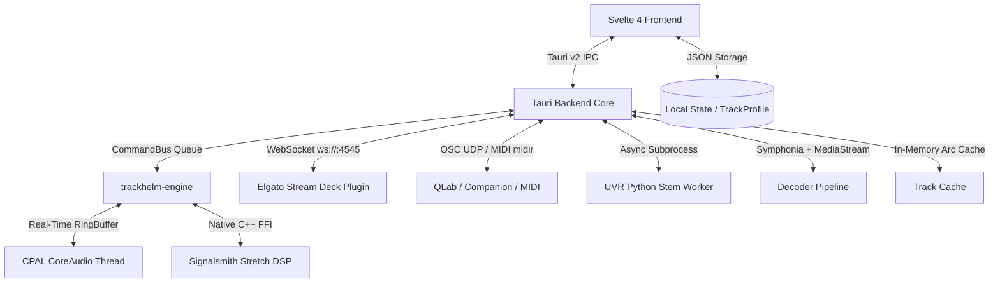

# TrackHelm 🎵

**TrackHelm** is a high-performance music rehearsal, transcription, and playback workstation built for musicians, musical directors, sound designers, and audio engineers. 

It combines real-time DSP pitch/time manipulation, instant deep-zoom waveform visualization, persistent per-song rehearsal profiles, dynamic multi-PDF sheet music & take tracking, interactive parametric EQ & dual-stage compression consoles, offline audio export, bi-directional song collections with live A/B compare, local AI stem separation (UVR), and low-latency native CoreAudio playback with comprehensive Stream Deck / MIDI / OSC show control and MCP integration.

---

## Key Features

### 🎧 Real-Time Rehearsal DSP Engine
* **Signalsmith Stretch Real-Time Integration**: Pristine, glitch-free tempo stretching ($0.25\times$ to $4.00\times$) and musical pitch transposition ($-24$ to $+24$ semitones) without cross-talk artifacts or audible buffer glitches. Permanently engaged by default at unity for seamless live modulation.
* **Sonitus-Inspired Dual-Stage Compressor Console**:
  * Dual independent compressor stages (`Stage 1` & `Stage 2`) switchable between **Series** and **Parallel** routing with wet/dry blend.
  * 4 analog & digital character models: **Vintage** (Tube), **Modern** (Clean VCA), **FET** (Ultra-Fast), and **Opto** (Smooth Optical).
  * Exact analytical soft-knee transfer function curve with **animated live signal tracing dot**, dual stereo input/output peak meters, vertical threshold/makeup sliders, and fast-decay gain reduction (GR) meter.
* **Precision Parametric Equalizer Console**:
  * Multi-filter cascaded biquad engine: **Parametric Bell (Peaking)**, **Low Shelf**, **High Shelf**, **Low Pass (High Cut)**, **High Pass (Low Cut)**, and **Notch (Band Stop)**.
  * Continuous logarithmic frequency spectrum graph ($20\text{ Hz} - 20\text{ kHz}$) with real-time 64-band animated Real-Time Analyzer (RTA) frequency spectrum and dynamic cumulative analytical EQ response curve.
  * **Interactive Node Dragging**: Click and drag filter nodes directly on the graph (horizontal for logarithmic frequency, vertical for gain $\pm 24\text{ dB}$).
  * **Mouse Wheel / Trackpad Q Control**: Scroll over nodes to expand or narrow filter bandwidth ($Q: 0.10 - 10.00$).
  * **Quick Add Bands**: Double-click anywhere on empty graph space or click `+ Add Filter Band` to drop a new filter node.
  * **Logarithmically Mapped Frequency Sliders**: Natural, uniform spacing across all octaves from $20\text{ Hz}$ to $20\text{ kHz}$.
* **Dedicated Module Bypass Toggles (`BYP`)**: Instant A/B bypass switches directly on the effects rack rows and inspector dialogs.
* **High-Fidelity Polyphase Resampling (`rubato`)**: Automatic sample rate conversion between source files (e.g. 44.1 kHz) and hardware DAC clocks (e.g. 48.0 kHz WASAPI / CoreAudio) with exact zero-latency phase alignment and bit-transparent bypass when unmodulated.
* **Low-Latency CPAL Audio Engine**: Lock-free native audio thread (CoreAudio on macOS, WASAPI on Windows) with zero heap allocations on the audio loop.
* **Hardware-Style Analog Dials**: Vertical drag controls with top 12 o'clock zero reference ticks (`.knob-zero-tick`) and double-click instant reset to defaults.

---

### 🔄 Bi-Directional Song Collections & Live A/B Compare
* **Peer-to-Peer Song Bundles**:
  * File associations are true bi-directional peers: if `Song.m4a` is associated with `Original.mp3` and `Chart.pdf`, opening `Original.mp3` directly from the File Browser automatically loads all sibling tracks, charts, and rehearsal markers.
  * Automatic collection discovery scans profiles on load to resolve the default track and synchronize stems across all members.
* **Live Synchronized A/B Compare (`⇄ A/B` & Hotkey `T`)**:
  * Audition stems, alternate takes, or reference mixes against the primary master mix on-the-fly.
  * Preserves exact playhead time and active playback seamlessly without interrupting audio or resetting playhead to 0:00.
  * Illuminated transport bar toggle button and instant hotkey `T`.

---

### 🌊 Dynamic Height-Adjustable Waveform & Interactive Audio Tags
* **Height-Adjustable Waveform Canvas**:
  * Ergonomic grab handle situated between the overview waveform (40px) and the main waveform allows smooth vertical resizing from 100px up to 650px (default 256px).
  * Double-click the resize handle to instantly restore the default 256px height.
  * User-adjusted height persists across app restarts (`th_waveform_height`).
* **Interactive Audio Tags**:
  * Automatically detects track roles from filename keywords: `Original`, `Vocals only`, `Lead Vocal`, `Background Vocals`, `Iso Track`, `Track`.
  * Multi-tag badges (`[ORIGINAL]`, `[VOCALS ONLY]`, `[LEAD VOCAL]`, `[BACKING VOCALS]`, `[ISO TRACK]`, `[TRACK]`, `[FULL-RES]`) display simultaneously in the `FILES` tab and mini-tags in the browser list.
  * Right-click any audio file card or right-click directly on the active waveform to toggle tags on/off in real-time.
  * Dynamically updates the overview waveform watermark banner and synchronizes bi-directionally across peer files.

---

### 📁 Streamlined Files Hub, Multi-Drive Explorer & AI Stem Separation (UVR)
* **Cross-Platform Directory Explorer**:
  * **Windows Multi-Drive Navigation**: Virtual "This PC" root directory enumerating all accessible drive letters (`C:`, `D:`, `E:`, `F:`, etc.) with volume names and drive icons.
  * **Direct Cloud Folder Bookmarks**: Instant quick-access links to user cloud storage roots across both Windows and macOS (Dropbox, Google Drive, Microsoft OneDrive, and iCloud).
* **Space-Efficient Single-Line Table (`FILES` Tab)**:
  * Compact horizontal rows (~32px height) displaying 10–12+ files without scrolling.
  * Role and format badges: `[DEFAULT]`, `[ORIGINAL]`, `[VOCALS]`, `[LEAD]`, `[BACKINGS]`, `[ISO TRACK]`, `[FULL-RES]`, `M4A`, `MP3`, `WAV`, `PDF`.
  * **Active Track Always Visible**: Highlights currently loaded file with a glowing `● ACTIVE` badge and `✓ Loaded` button state.
  * **Intelligent Action Button Filtering**: Sub-stems already isolated as Lead Vocals or Backing Vocals automatically suppress recursive stem buttons (`🎤 Lead/Backups` / `✨ Isolate Vocals`), keeping the file deck clean and focused.
* **Local Headless Stem Separation (UVR)**:
  * **Hardware-Accelerated Execution**: Runs with NVIDIA CUDA acceleration on Windows and Apple Silicon MPS on macOS, falling back gracefully to multi-threaded CPU processing.
  * **Automated Model Discovery & Download Fallback**: Automatically discovers and links existing Ultimate Vocal Remover models from local installations, falling back to on-demand automatic downloads from HuggingFace/GitHub when models are not present locally.
  * **4-Model Ensemble Vocal & Iso Track Isolation**: Blends Kim Vocal 2, MDX23C-InstVoc HQ, UVR-MDX-NET-Voc_FT, and Demucs v4 via `uvr_max_spec` to simultaneously isolate pristine master vocals (`(Vocals Ensemble).m4a`) and the clean isolated instrumental accompaniment (`(Iso Track).m4a`).
  * **5HP Karaoke Lead vs. Backing Split**: Splits isolated vocals into discrete Lead Vocals and Backing Harmonies stems.
  * **Self-Extracting Architecture**: Binary embeds worker script fallbacks to guarantee execution across installed, portable, or development deployments.
  * **Cross-Volume Junction Resolution**: Transparently links pre-downloaded Ultimate Vocal Remover models across NTFS drive junctions without extra disk usage.
  * **Clean Stderr Stream Filtering**: Formats informational startup and progress messages to stdout and filters stderr in the native host, ensuring the UI remains free of premature error banners.
  * **Direct Active Track Triggering**: Run `✨ Isolate Vocals` directly on whatever track is loaded without switching files.
  * Renders high-quality AAC `.m4a` directly into the song's `Vocals Only/` subfolder with real-time inline progress streaming.
* **Safe OS Trash / Recycle Bin Integration**:
  * Move unwanted stems or charts to macOS Finder Trash or Windows Recycle Bin (`🗑️`) with confirmation modals, preserving native "Put Back" / Restore capabilities.

---

### ⚡ Smooth Type-to-Jump / Typeahead Engine
* **Instant Keyboard Navigation**:
  * Start typing in the File Browser or Playlist to jump and smoothly scroll to the matching song or folder.
  * **Immediate Character Refinement**: Typing `B` jumps immediately to the first "B" song; typing `E` within the 750ms typing window immediately jumps to the first `BE...` song (never jumping away to "E").
  * **Same-Character Cycling**: Repeatedly pressing the same letter (e.g. `B` ... `B` ... `B`) cycles through all tracks starting with that letter.
  * **Smart Track Number & Article Stripping**: Ignores leading track numbers (e.g. `01 - `, `02. `, `1-01 `) and `The `, so typing `B` matches `01 Beat It.mp3` or `The Beatles`.
  * **Floating Visual Badge**: Discreet `🔤 Jump: [query]` indicator displays current buffer and fades out after rest period.
  * **Context-Aware Hotkey Protection**: DAW hotkeys (`M`, `R`, `X`, `L`, `T`) are preserved when working on the waveform, while routing to search queries when typing in the sidebar.

---

### 📋 Setlist AI CSV Importer & Playlist Health Repair
* **AI Setlist CSV Importer (`🪄 Setlist...`)**:
  * Import setlists directly from CSV tables, spreadsheets, or clipboard text.
  * Fuzzy matching automatically maps song titles and artists to local audio library files.
* **Playlist Health & Upgraded Mix Repair (`🔄 Repair`)**:
  * Detects missing audio files or cloud placeholders (`⚠️ Missing Audio`).
  * Suggests upgraded lossless or replacement mixes with confidence scoring.
  * Migrates markers, regions, and rehearsal notes to newly relinked files.
* **Playlist Formats**: Save and load `.thset` (native TrackHelm setlist), `.m3u8`, `.m3u`, and `.json`.

---

### ⚙️ Preferences & Library Management (`Cmd+,` / `Ctrl+,`)
* **5 Dedicated Library Directory Designations**:
  * **AAC**: Low-Res Performance Tracks (`.m4a`, `.aac`, `.mp3`)
  * **WAV**: Full-Res Lossless Performance Masters (`.wav`, `.flac`, `.aiff`)
  * **ORIG**: Original Artist Reference Recordings
  * **PDF**: Sheet Music & Chord Charts
  * **VOC**: Isolated Vocals & Stems (UVR output directory)
* **⚡ Batch Auto-Link Library Files (Fuzzy Match)**:
  * One-click engine scans across all designated folders (and any `Vocals Only/` subdirectories) and uses token Jaccard and Levenshtein distance metrics to automatically pair performance tracks with matching originals, sheet music PDFs, full-res alternates, and vocal/iso stems into bi-directional collections.
* **Prefer High-Res Audio Toggle**: When enabled, automatically loads the lossless audio file as main track if downloaded locally.
* **Cloud Placeholder Detection**: Accurately detects online-only dataless cloud files on APFS / iCloud / Dropbox / OneDrive.

---

### 🕹️ Stream Deck, MIDI, OSC & MCP Show Control
* **Elgato Stream Deck Plugin (`com.trackhelm.controller.sdPlugin`)**:
  * Pre-built 15-key and 32-key show control profiles with custom high-contrast retina LCD icons.
  * Real-time dynamic LCD readouts: Track Name, Elapsed Time, Landmark Marker Cues, Pitch Transposition, Volume dB, Speed Multiplier, and Play/Pause State.
  * Automated installation via `npm run build:streamdeck`.
* **WebSocket Control Server (`ws://0.0.0.0:4545`)**: Fast, non-terminating lag-tolerant two-way WebSocket broadcast server for custom remote apps and hardware controllers.
* **OSC Integration (`/trackhelm/*`)**: UDP-based Open Sound Control endpoints for QLab, Bitfocus Companion, and digital mixing consoles.
* **Hardware MIDI Integration (`midir`)**: Real-time MIDI hardware support with CC 7 Volume, CC 1 Speed modulation, and Note-on transport triggers.
* **Model Context Protocol (MCP) Server**: Integrated MCP server allowing AI coding assistants and agents to inspect playback state, set markers, and trigger transport controls.

---

### 💾 High-Fidelity Audio Export Engine
* **Non-Destructive Offline DSP Render (`Cmd+Shift+E`)**:
  * Offline multi-threaded audio renderer baking all active DSP parameters into pristine audio files.
  * Configurable ranges: Full Song, Active Time Selection, or Selected Region.
  * Formats: 16-bit WAV (CD Standard), 24-bit WAV (Studio Master), or 32-bit Float WAV.
  * Bakes pitch, speed, EQ cascade, compression stages, and smooth splice crossfades.
  * Preserves full ID3v2 / Vorbis metadata tags and album artwork.

---

### 📝 Rehearsal Deck: Dynamic Multi-PDFs & Markdown Notes/Lyrics
* **Dynamic Multi-PDF Tabs**: Opening associated PDFs automatically spawns dedicated dynamic tabs (e.g. `📄 Chart.pdf ×`) with independent page scroll tracking, close buttons, and **Negative Invert** dark mode for stage readability.
* **Obsidian-Style Markdown Notes & Lyrics**: Rich formatting for song notes, arrangement guides, and lyrics with Edit, Preview, and Side-by-Side Split view modes.
* **Automatic Rehearsal Chord Badge Parsing**: Parses chords (e.g. `[Am7]`, `[G/B]`, `[Cadd9]`) into glowing high-contrast badges optimized for live performance reading.
* **Audio Tag Metadata Inspector**: View and edit ID3v1/v2, Vorbis, MP4/M4A, and FLAC tags in-place via Lofty.

---

### ⚡ Instant Loading & Deep Waveform Visualization
* **Zero-Delay Playback Readiness ($< 1\text{ms}$)**: Single-click background pre-decoding (`preload_track`) and SIMD/NEON compiler optimizations (`opt-level = 3`).
* **Continuous Unbroken Oscillating Waveform**: Single-sample continuous line rendering at all zoom levels, eliminating sawtooth min/max ramp gaps.
* **Progressive Sample Node Squares (RX Style)**: Visualizes individual audio sample points with adaptive bordered node boxes when zoomed in ($\le 400$ samples down to 9 samples).
* **Dotted Compressor Threshold Overlay**: Yellow dotted boundary lines mark threshold level on the waveform as it is brought down below $0\text{ dB}$.
* **Dual-View Waveform System**: Resizable zoomed main waveform display with synchronized overview scrubber bars.

---

### 📍 Rehearsal Markers & Timeline Regions
* **Interactive Color Palette**: Assign and cycle through vibrant rehearsal colors (🟠 Amber, 🔵 Cyan, 🟢 Green, 🟣 Purple, 🔴 Red, 🟡 Yellow).
* **Interactive Timeline Regions**:
  * **Loop / Vamp Mode 🔁 (`L`)**: Green highlighted span with boundary brackets; native audio engine seamlessly cycles playback back to start.
  * **Cut / Skip Mode ✕ (`X`)**: Grayed-out hazard hatch overlay; native engine automatically jumps over cut spans during playback with zero gap or silence latency.
  * **Splice Crossfade Control**: Direct click-to-edit crossfade badge (`✕ 5ms`) adjusts splice transition smoothing ($0 - 100\text{ ms}$).
  * **Region Edge Dragging**: Post-commit draggable handles adjust region boundaries in real-time.
  * **Inline Renaming**: Double-click any marker or region in the sidebar, click `✏️`, or right-click to rename.

---

## ⌨️ Keyboard Shortcuts

| Shortcut | Context | Action |
| :--- | :--- | :--- |
| **`Space`** | Global | Play / Pause toggle for active audio track |
| **`Return` / `Enter`** | Global | Load & Play highlighted track (or Stop & Rewind to 0:00) |
| **`ArrowUp` / `ArrowDown`** | Sidebar | Navigate Playlist / Browser tracks |
| **`Alt + ArrowUp` / `Down`** | Playlist | Reorder highlighted song up/down in playlist |
| **`ArrowLeft` / `ArrowRight`**| Global | Jump to Previous / Next Marker |
| **`T`** | Global | Toggle **⇄ A/B Compare** (Audition Stem vs Default Mix) |
| **`M`** | Waveform | Drop a new Marker at current playhead position |
| **`R`** | Waveform | Create a Region from active selection or selected markers |
| **`L`** | Waveform | Create / Toggle **Loop / Vamp Mode 🔁** |
| **`X`** | Waveform | Create / Toggle **Cut / Skip Mode ✕** |
| **`Type Alphanumeric`** | Sidebar | **Type-to-Jump**: Immediately jump to song matching prefix |
| **`Cmd + Shift + E`** | Global | Open Offline Audio Export dialog |
| **`Cmd + Shift + R`** | Global | Open Remote Show Control & MIDI settings |
| **`Cmd + ,`** | Global | Open Preferences dialog |
| **`Cmd + Q`** | Global | Quit TrackHelm |
| **`Shift + Drag`** | Waveform | Create interactive time selection span |
| **`Shift + Click`** | Markers | Select two markers to form a time selection span |
| **`Double Click` (EQ)** | EQ Graph | Add a new EQ filter band at clicked frequency and gain |
| **`Mouse Wheel` (EQ Node)**| EQ Graph | Adjust EQ filter band $Q$ / bandwidth |
| **`Double Click` (Knob)** | Controls | Reset parameter to default unity / zero |
| **`Escape`** | Global | Cancel typeahead, close menus, stop all tracks |

---

## Architecture Overview



### Technology Stack
* **Desktop Shell**: [Tauri v2](https://v2.tauri.app/) (Rust + Webview2 / WebKit)
* **Frontend UI**: [Svelte 4](https://svelte.dev/) + TypeScript + Vite + HTML5 Canvas
* **Audio Engine**: Native Rust real-time CPAL stream (CoreAudio on macOS, WASAPI on Windows) with custom lock-free ringbuffers
* **DSP & Resampling Algorithms**: 
  * [rubato](https://github.com/HEnquist/rubato) (Polyphase FFT sample rate resampler with zero-latency phase alignment)
  * [Signalsmith Stretch](https://signalsmith-audio.co.uk/code/stretch/) (C++11 via Rust FFI static build)
  * Cascaded RBJ 64-bit Biquad Filters (Peaking, Shelves, High/Low Pass, Notch)
  * Dual-Stage Feedforward Soft-Knee Compressor (Vintage, Modern, FET, Opto)
* **Decoders & Tags**: Symphonia with $128\text{KB}$ streaming buffers + Lofty ID3v2/Vorbis tag engine
* **AI Stems**: Ultimate Vocal Remover models via headless Python runner (`audio-separator`) + native AAC encoding (with Apple Silicon MPS & NVIDIA CUDA acceleration)
* **External Control**: Custom Elgato Stream Deck Plugin + `tokio-tungstenite` WebSocket server + `midir` + `rosc` + MCP Server

---

## Getting Started

### Prerequisites
* **macOS**: Apple Silicon (M1/M2/M3/M4) or Intel x86_64, Xcode Command Line Tools.
* **Windows**: Windows 10 or 11 (64-bit), Visual Studio 2022 C++ Build Tools (MSVC `cl.exe`), and Python 3.10/3.11 for UVR.
* [Rust](https://rustup.rs/) (edition 2021+)
* [Node.js](https://nodejs.org/) (v18+)

### Development
```bash
# Clone the repository
git clone https://github.com/jwink75/TrackHelm.git
cd TrackHelm

# Install frontend dependencies
npm install

# Start Tauri development environment
# On macOS:
make dev
# On Windows / macOS (PowerShell or Bash):
npm run tauri dev
```

### Building the Stream Deck Plugin
```bash
# On macOS:
npm run build:streamdeck
# On Windows (PowerShell):
.\integrations\streamdeck\package_plugin.ps1
```

### Packaging & Release Bundles

#### macOS Application Bundle
```bash
make app
```
The compiled `TrackHelm.app` will be created in `build/TrackHelm.app` and can be dragged directly to `/Applications` or the macOS Dock.

#### Windows Installers (NSIS Setup & MSI)
```powershell
npm run tauri build
```
The production installers will be generated in:
* **NSIS Setup:** `src-tauri/target/release/bundle/nsis/TrackHelm_<version>_x64-setup.exe`
* **WiX MSI:** `src-tauri/target/release/bundle/msi/TrackHelm_<version>_x64_en-US.msi`

---

## Documentation
* [Project Bible](Project%20Bible.md) — Comprehensive technical design document, architecture decisions (ADRs), and feature specifications.
* [Windows Implementation Guide](TrackHelm%20Windows%20Implementation.md) — Architectural roadmap and step-by-step instructions for porting and building TrackHelm on Windows.
* [Agent Rules](GEMINI.md) — Workspace coding guidelines and paired programming rules.
