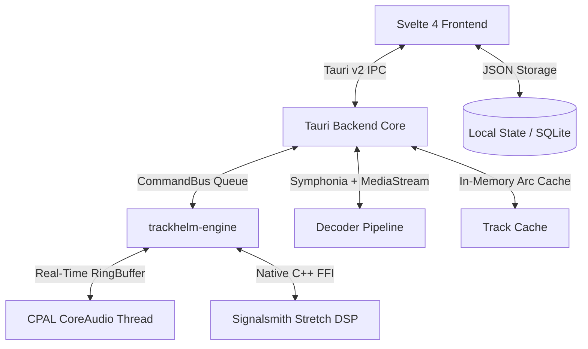

# TrackHelm 🎵

**TrackHelm** is a high-performance music rehearsal, transcription, and playback workstation built for musicians, musical directors, sound designers, and audio engineers. 

It combines real-time DSP pitch/time manipulation, instant deep-zoom waveform visualization, persistent per-song rehearsal profiles, associated sheet music & take tracking, and low-latency native CoreAudio playback.

---

## Key Features

### 🎧 Real-Time Rehearsal DSP Engine
* **Signalsmith Stretch Real-Time Integration**: Pristine tempo stretching ($0.25\times$ to $4.00\times$) and musical pitch transposition ($-24$ to $+24$ semitones) without cross-talk artifacts.
* **Low-Latency CPAL CoreAudio Engine**: Lock-free native audio thread with zero-latency hardware bypass when at unity settings ($1.0\times$ speed, $0\text{ st}$ pitch).
* **Hardware-Style Analog Dials**: Vertical drag controls with top 12 o'clock zero reference ticks (`.knob-zero-tick`) and double-click instant reset.

### ⚡ Instant Loading & Deep Waveform Visualization
* **Zero-Delay Playback Readiness ($< 1\text{ms}$)**: Single-click background pre-decoding (`preload_track`) and SIMD/NEON compiler optimizations (`opt-level = 3`) ensure songs start playing instantaneously.
* **Continuous Unbroken Oscillating Waveform**: Single-sample continuous line rendering at all zoom levels, eliminating sawtooth min/max ramp gaps.
* **Progressive Sample Node Squares (RX Style)**: Visualizes individual audio sample points with adaptive bordered node boxes when zoomed in ($\le 400$ samples down to 9 samples).
* **Dual-View Waveform System**: Resizable zoomed main waveform display with synchronized overview scrubber bars for both Main and Alternate audio tracks.
* **Smart Centered Playhead**: Locks playhead to the center when zoomed in for continuous tracking; smoothly sweeps edge-to-edge when zoomed out.

### 📍 Rehearsal Markers & Regions
* **Interactive Color Palette**: Assign and cycle through vibrant rehearsal colors (🟠 Amber, 🔵 Cyan, 🟢 Green, 🟣 Purple, 🔴 Red, 🟡 Yellow).
* **Inline Renaming**: Double-click any marker label to rename directly in the sidebar with instant validation.
* **Synchronized Flags**: Matching colored flag pins and vertical guidelines rendered across the top time ruler and main timeline.
* **Keyboard Navigation**: Jump between markers with `ArrowLeft` / `ArrowRight`.

### 📂 Per-Track Persistent Project Profiles (AnyTune Style)
* **Automatic State Preservation**: Every song maintains an independent persistent profile (`TrackProfile`):
  * Speed & Pitch knob settings
  * Volume & Master Gain
  * EQ (Bass/Treble) and Compressor settings
  * Marker timestamps, names, and custom colors
  * Linked PDF Chart path & sheet music attachments
  * Associated alternate versions, backing tracks, stems, and live takes
* Hot-swappable Main and Alternate audio track modes.

### 📁 OS Folder Browser & Playlist
* Native filesystem directory navigation with fuzzy search and quick type-ahead jump.
* Custom right-click context menu (Load as Main, Load as Alternate, Add to Playlist).
* Standalone virtual playlist manager.

---

## ⌨️ Keyboard Shortcuts

| Shortcut | Action |
| :--- | :--- |
| **`Space`** | Play / Pause toggle |
| **`ArrowLeft`** | Jump to Previous Marker (or rewind to 0:00) |
| **`ArrowRight`** | Jump to Next Marker |
| **`Return` / `Enter`** | Stop playback and rewind to beginning |
| **`Single Click` (Browser/Playlist)** | Select file & trigger background pre-decode |
| **`Double Click` (Browser/Playlist)** | Instantly load and play file |
| **`Double Click` (Knob / Slider)** | Reset parameter to default unity / zero |
| **`Double Click` (Marker)** | Inline rename marker |

---

## Architecture Overview



### Technology Stack
* **Desktop Shell**: [Tauri v2](https://v2.tauri.app/) (Rust + Webview)
* **Frontend UI**: [Svelte 4](https://svelte.dev/) + TypeScript + Vite + HTML5 Canvas
* **Audio Engine**: Native Rust real-time CPAL stream with custom lock-free ringbuffers
* **DSP Algorithm**: [Signalsmith Stretch](https://signalsmith-audio.co.uk/code/stretch/) (C++11 via Rust FFI static build)
* **Audio Decoders**: Symphonia with $128\text{KB}$ streaming buffers and SIMD acceleration

---

## Getting Started

### Prerequisites
* macOS with Apple Silicon or Intel CPU
* [Rust](https://rustup.rs/) (edition 2021+)
* [Node.js](https://nodejs.org/) (v18+)

### Development
```bash
# Clone the repository
git clone https://github.com/winkler/TrackHelm.git
cd TrackHelm

# Install frontend dependencies
npm install

# Start Tauri development environment
make dev
# or: npm run tauri dev
```

### Building the macOS Application Bundle
```bash
make app
```
The compiled `TrackHelm.app` will be created in the workspace root and can be dragged directly to `/Applications` or the macOS Dock.

---

## Documentation
* [Project Bible](Project%20Bible.md) — Comprehensive technical design document, architecture decisions (ADRs), and feature specifications.
* [Agent Rules](GEMINI.md) — Workspace coding guidelines and paired programming rules.
