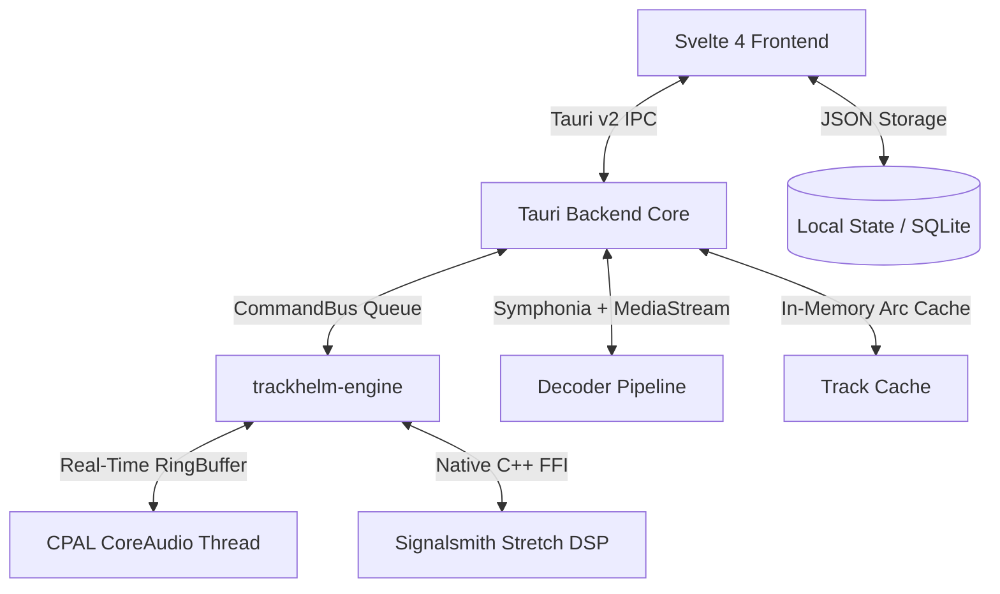

# TrackHelm 🎵

**TrackHelm** is a high-performance music rehearsal, transcription, and playback workstation built for musicians, musical directors, sound designers, and audio engineers. 

It combines real-time DSP pitch/time manipulation, instant deep-zoom waveform visualization, persistent per-song rehearsal profiles, associated sheet music & take tracking, and low-latency native CoreAudio playback.

---

## Key Features

### 🎧 Real-Time Rehearsal DSP Engine
* **Signalsmith Stretch Real-Time Integration**: Pristine tempo stretching ($0.25\times$ to $4.00\times$) and musical pitch transposition ($-24$ to $+24$ semitones) without cross-talk artifacts.
* **Sonitus-Inspired Dual-Stage Compressor Console**:
  * Dual independent compressor stages (`Stage 1` & `Stage 2`) switchable between **Series** and **Parallel** routing with wet/dry blend.
  * 4 analog & digital character models: **Vintage** (Tube), **Modern** (Clean VCA), **FET** (Ultra-Fast), and **Opto** (Smooth Optical).
  * Real-time transfer curve SVG graph with **animated live signal tracing dot**, dual stereo input/output peak meters, vertical threshold/makeup sliders, and fast-decay gain reduction (GR) meter.
* **Kirchhoff & AnyTune-Inspired Parametric Equalizer Console**:
  * Multi-filter cascaded biquad engine: **Parametric Bell (Peaking)**, **Low Shelf**, **High Shelf**, **Low Pass (High Cut)**, **High Pass (Low Cut)**, and **Notch (Band Stop)**.
  * Continuous logarithmic frequency spectrum graph ($20\text{ Hz} - 20\text{ kHz}$) with ghosted audio spectrum background and dynamic cumulative EQ response curve.
  * Interactive draggable SVG node handles with $Q$-bandwidth wings and bottom parameter editing deck.
* **Dedicated Module Bypass Toggles (`BYP`)**: Instant A/B bypass switches directly on the effects rack rows and inspector dialogs.
* **Low-Latency CPAL CoreAudio Engine**: Lock-free native audio thread with zero-latency hardware bypass when at unity settings ($1.0\times$ speed, $0\text{ st}$ pitch).
* **Hardware-Style Analog Dials**: Vertical drag controls with top 12 o'clock zero reference ticks (`.knob-zero-tick`) and double-click instant reset.

### 📝 Rehearsal Deck: Dynamic Multi-PDFs & Markdown Notes/Lyrics
* **Rehearsal Files Hub (`FILES` Tab)**: Central manager for all associated sheet music, chord charts, alternate takes, guide tracks, and stems with one-click opening and loading.
* **Dynamic Multi-PDF Tabs**: Opening associated PDFs automatically spawns dedicated dynamic tabs (e.g. `📄 Chart.pdf ×`) with independent page scroll tracking, close buttons, and **Negative Invert** dark mode for stage readability.
* **Obsidian-Style Markdown Notes & Lyrics**: Rich formatting for song notes, arrangement guides, and lyrics with Edit, Preview, and Side-by-Side Split view modes.
* **Automatic Rehearsal Chord Badge Parsing**: Parses chords (e.g. `[Am7]`, `[G/B]`, `[Cadd9]`) into glowing high-contrast badges optimized for live performance reading.

### ⚡ Instant Loading & Deep Waveform Visualization
* **Zero-Delay Playback Readiness ($< 1\text{ms}$)**: Single-click background pre-decoding (`preload_track`) and SIMD/NEON compiler optimizations (`opt-level = 3`) ensure songs start playing instantaneously.
* **Continuous Unbroken Oscillating Waveform**: Single-sample continuous line rendering at all zoom levels, eliminating sawtooth min/max ramp gaps.
* **Progressive Sample Node Squares (RX Style)**: Visualizes individual audio sample points with adaptive bordered node boxes when zoomed in ($\le 400$ samples down to 9 samples).
* **Dotted Compressor Threshold Overlay**: Yellow dotted boundary lines mark threshold level on the waveform as it is brought down below $0\text{ dB}$.
* **Ghost Uncompressed vs. Compressed Waveform**: Visualizes original waveform as a translucent white ghost while rendering the compressed waveform in full vibrant theme color.
* **Dual-View Waveform System**: Resizable zoomed main waveform display with synchronized overview scrubber bars for both Main and Alternate audio tracks.
* **Smart Centered Playhead**: Locks playhead to the center when zoomed in for continuous tracking; smoothly sweeps edge-to-edge when zoomed out.

### 📍 Rehearsal Markers & Timeline Regions
* **Interactive Color Palette**: Assign and cycle through vibrant rehearsal colors (🟠 Amber, 🔵 Cyan, 🟢 Green, 🟣 Purple, 🔴 Red, 🟡 Yellow).
* **Multi-Marker Selection**: Hold `Shift` while clicking markers in the sidebar or along the top ruler to select pairs.
* **Selection Edge Grab Handles**: Shift-drag to create selection spans; grab left or right edges ($\pm 8\text{px}$) to adjust boundaries before committing.
* **Interactive Timeline Regions**:
  * **Loop / Vamp Mode 🔁 (`L`)**: Green highlighted span with boundary brackets; native audio engine seamlessly cycles playback back to start.
  * **Cut / Skip Mode ✂️ (`X`)**: Grayed-out hazard hatch overlay; native engine automatically jumps over cut spans during playback.
  * **Region Edge Dragging**: Post-commit draggable handles adjust region boundaries in real-time.
  * **Inline Renaming**: Double-click any marker or region in the sidebar, click `✏️`, or right-click to rename.
* **Keyboard Navigation**: Jump between markers with `ArrowLeft` / `ArrowRight`.
* **Maximized Sidebar Height**: 100% full-height sidebar allocation for markers and regions list.

### 📂 Per-Track Persistent Project Profiles (AnyTune Style)
* **Automatic State Preservation**: Every song maintains an independent persistent profile (`TrackProfile`):
  * Speed & Pitch knob settings (including Fine Tune $\pm 100\text{ ct}$)
  * Volume & Master Gain
  * EQ cascade bands (Peaking/Shelves/Filters) and Dual Compressor parameters
  * Bypass flags (`isEqBypassed`, `isCompressorBypassed`)
  * Markers and Regions (timestamps, names, colors, loop/cut modes)
  * Associated files list, dynamic PDF tabs, and notes/lyrics markdown text with view modes
* Hot-swappable Main and Alternate audio track modes.

### 📁 OS Folder Browser & Playlist
* Native filesystem directory navigation with fuzzy search and quick type-ahead jump.
* Custom right-click context menu (Load as Main, Load as Alternate, Add to Playlist).
* Standalone virtual playlist manager.

---

## ⌨️ Keyboard Shortcuts

| Shortcut | Action |
| :--- | :--- |
| **`Space`** | Play / Pause toggle |
| **`ArrowLeft`** | Jump to Previous Marker (or rewind to 0:00) |
| **`ArrowRight`** | Jump to Next Marker |
| **`Return` / `Enter`** | Start selected track (in browser) or Stop playback |
| **`M`** | Drop a new Marker at current playhead position |
| **`R`** | Create a Region from active selection or selected markers |
| **`L`** | Create / Toggle **Loop / Vamp Mode 🔁** for selection or selected region |
| **`X`** | Create / Toggle **Cut / Skip Mode ✂️** for selection or selected region |
| **`Shift + Drag`** | Create interactive time selection on waveform |
| **`Shift + Click` (Markers)** | Select two markers to form a time selection span |
| **`Drag Edge Handles`** | Resize time selection or region boundaries |
| **`Single Click` (Browser/Playlist)** | Select file & trigger background pre-decode |
| **`Double Click` (Browser/Playlist)** | Instantly load and play file |
| **`Double Click` (Knob / Slider)** | Reset parameter to default unity / zero |
| **`Double Click` (Marker / Region)** | Inline rename marker or region |

---

## Architecture Overview



### Technology Stack
* **Desktop Shell**: [Tauri v2](https://v2.tauri.app/) (Rust + Webview)
* **Frontend UI**: [Svelte 4](https://svelte.dev/) + TypeScript + Vite + HTML5 Canvas
* **Audio Engine**: Native Rust real-time CPAL stream with custom lock-free ringbuffers
* **DSP Algorithm**: [Signalsmith Stretch](https://signalsmith-audio.co.uk/code/stretch/) (C++11 via Rust FFI static build)
* **Audio Decoders**: Symphonia with $128\text{KB}$ streaming buffers and SIMD acceleration

---

## Getting Started

### Prerequisites
* macOS with Apple Silicon or Intel CPU
* [Rust](https://rustup.rs/) (edition 2021+)
* [Node.js](https://nodejs.org/) (v18+)

### Development
```bash
# Clone the repository
git clone https://github.com/winkler/TrackHelm.git
cd TrackHelm

# Install frontend dependencies
npm install

# Start Tauri development environment
make dev
# or: npm run tauri dev
```

### Building the macOS Application Bundle
```bash
make app
```
The compiled `TrackHelm.app` will be created in the workspace root and can be dragged directly to `/Applications` or the macOS Dock.

---

## Documentation
* [Project Bible](Project%20Bible.md) — Comprehensive technical design document, architecture decisions (ADRs), and feature specifications.
* [Agent Rules](GEMINI.md) — Workspace coding guidelines and paired programming rules.
